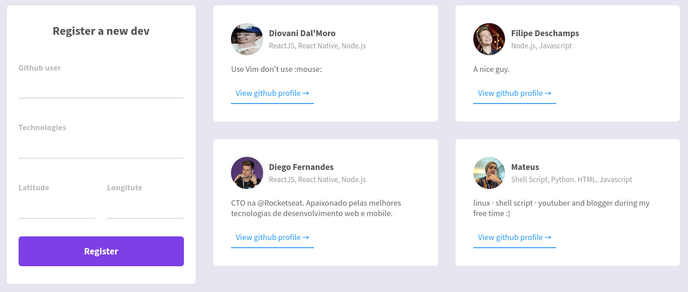
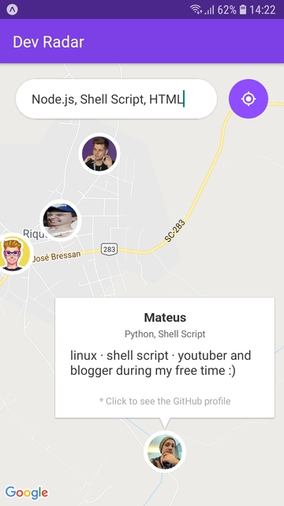
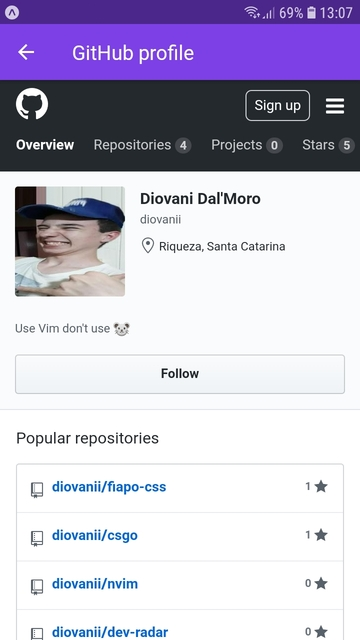

# Dev Radar :artificial_satellite:

* #### [Desktop version](#desktop-version)
* #### [Mobile version](#mobile-version)

 

## The tenth OmniStack week from **[Rocketseat :rocket:](https://rocketseat.com.br)**

 

#### :computer: Desktop version

###### In the desktop version you can register developers and see a list of those that are registered

 

---

 

### :iphone: Mobile version

###### You can search for developers by technologies and view the GitHub profile of them

 
 
 
 
 

###### This repository is under the [MIT License](https://www.opensource.org/licenses/MIT) :page_with_curl:
